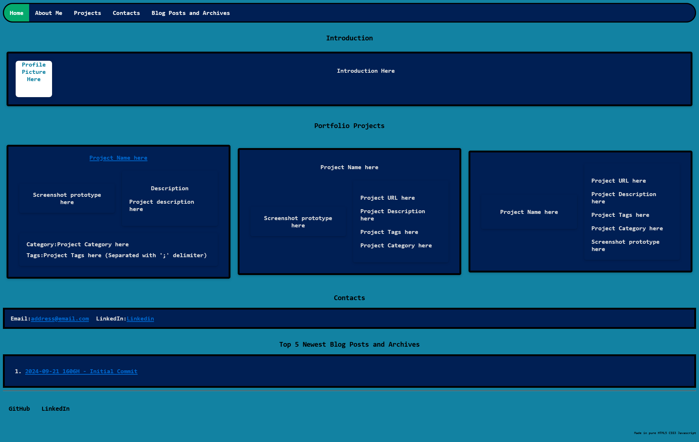
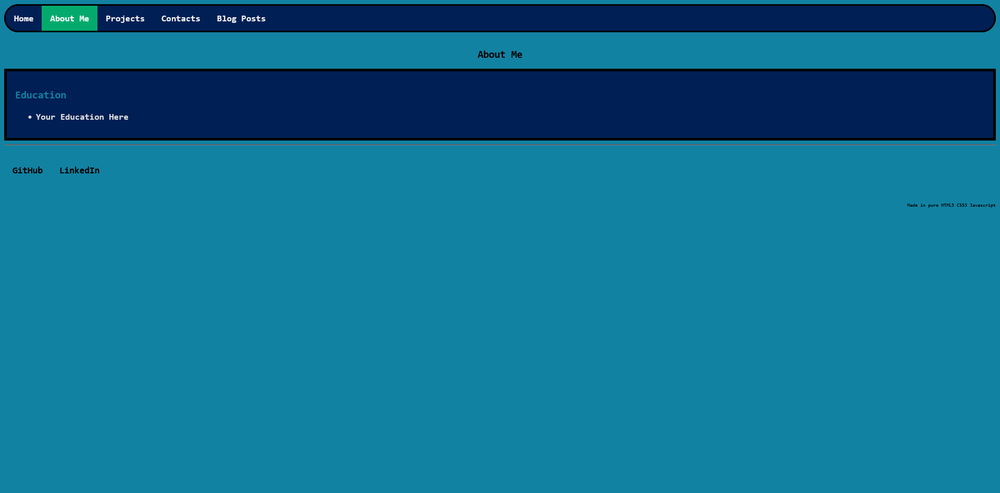
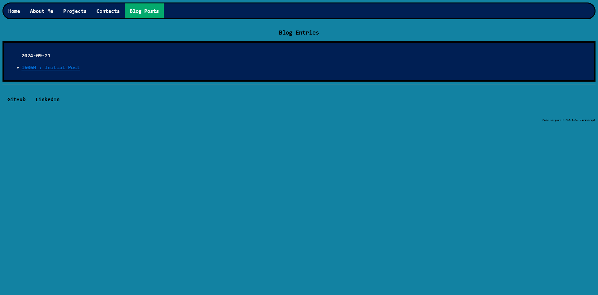
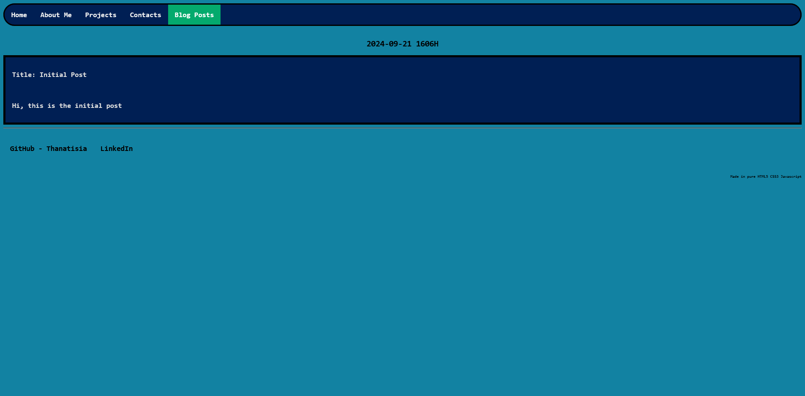
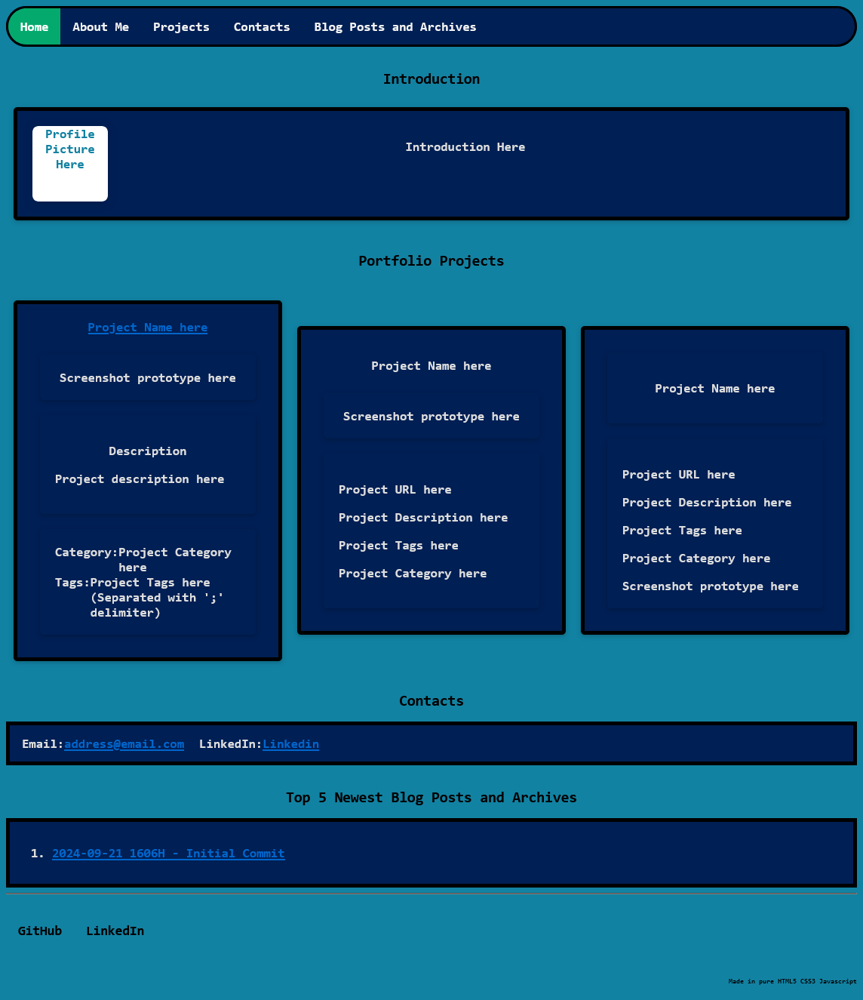
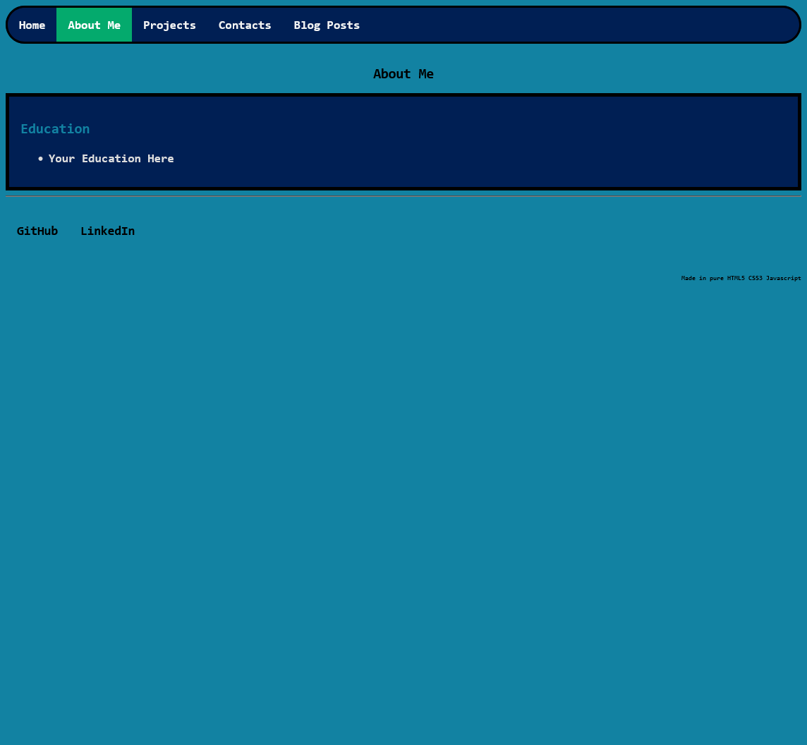
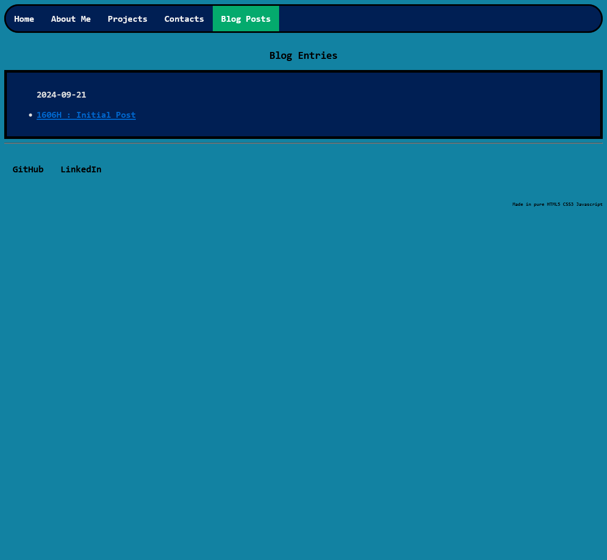
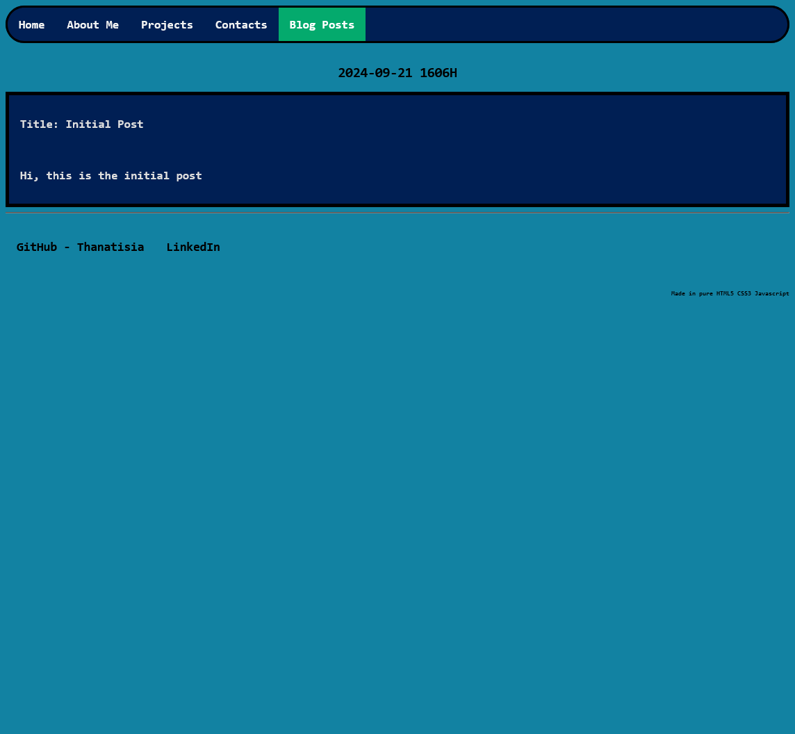

# My Portfolio Website

## Information

### Description
+ This is my portfolio website designed and developed entirely using pure HTML5 CSS3 and Javascript, that will be hosted in a Static web hosting service/service as opposed to dynamic web hosting

### Project
- Tech stack
    + Frontend: HTML5, CSS3
    + Backend: Javascript

- Consideration
    - Frameworks
        + Frontend: ReactJS, TailwindCSS, SvelteJS
        + Backend: Flask
    + Static Site Generators : Hugo, Jekyll

## Setup

### Dependencies

### Pre-Requisites

### Build
> NIL

### Deployment

- Notes
    - As this is a static web application that is built from pure HTML5 CSS3 and Javascript, you can just use any web browser and load up the index.html file directly
        + However, you can also deploy this in any HTTP/Webserver

- Using nginx
    - Design configuration file
        ```conf
        TBC
        ```
    - Starting up nginx
        ```bash
        ```

- Using NodeJS
    - Design Webserver
        ```js
        ```
    - Starting up server
        ```bash
        ```

- Using the python http module's server function
    ```bash
    python -m http.server -p {port-number (default: 8080)}
    ```


## Documentations

### Screenshots

> Full screen

+ 
+ 
+ 
+ 

> Resolution: 1144 x 1056 px

+ 
+ 
+ 
+ 

## Resources

## References

## Remarks

